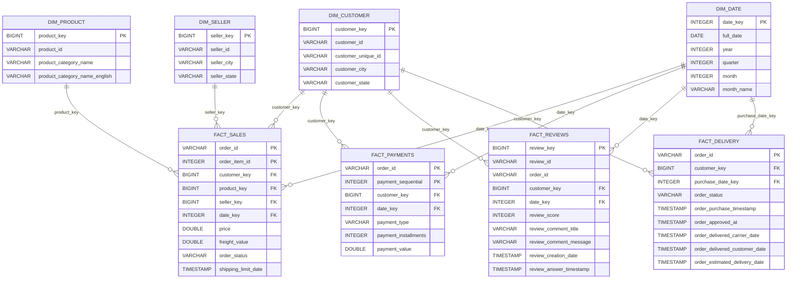

# Olist E-Commerce Warehouse ERD

```mermaid
erDiagram

    DIM_CUSTOMER {
        BIGINT customer_key PK
        VARCHAR customer_id
        VARCHAR customer_unique_id
        VARCHAR customer_city
        VARCHAR customer_state
    }

    DIM_PRODUCT {
        BIGINT product_key PK
        VARCHAR product_id
        VARCHAR product_category_name
        VARCHAR product_category_name_english
    }

    DIM_SELLER {
        BIGINT seller_key PK
        VARCHAR seller_id
        VARCHAR seller_city
        VARCHAR seller_state
    }

    DIM_DATE {
        INTEGER date_key PK
        DATE full_date
        INTEGER year
        INTEGER quarter
        INTEGER month
        VARCHAR month_name
    }

    FACT_SALES {
        VARCHAR order_id PK
        INTEGER order_item_id PK
        BIGINT customer_key FK
        BIGINT product_key FK
        BIGINT seller_key FK
        INTEGER date_key FK
        DOUBLE price
        DOUBLE freight_value
        VARCHAR order_status
        TIMESTAMP shipping_limit_date
    }

    FACT_PAYMENTS {
        VARCHAR order_id PK
        INTEGER payment_sequential PK
        BIGINT customer_key FK
        INTEGER date_key FK
        VARCHAR payment_type
        INTEGER payment_installments
        DOUBLE payment_value
    }

    FACT_REVIEWS {
        BIGINT review_key PK
        VARCHAR review_id
        VARCHAR order_id
        BIGINT customer_key FK
        INTEGER date_key FK
        INTEGER review_score
        VARCHAR review_comment_title
        VARCHAR review_comment_message
        TIMESTAMP review_creation_date
        TIMESTAMP review_answer_timestamp

    }

    FACT_DELIVERY {
        VARCHAR order_id PK
        BIGINT customer_key FK
        INTEGER purchase_date_key FK
        VARCHAR order_status
        TIMESTAMP order_purchase_timestamp
        TIMESTAMP order_approved_at
        TIMESTAMP order_delivered_carrier_date
        TIMESTAMP order_delivered_customer_date
        TIMESTAMP order_estimated_delivery_date
    }


    DIM_CUSTOMER ||--o{ FACT_SALES : customer_key
    DIM_PRODUCT  ||--o{ FACT_SALES : product_key
    DIM_SELLER   ||--o{ FACT_SALES : seller_key
    DIM_DATE     ||--o{ FACT_SALES : date_key

    DIM_CUSTOMER ||--o{ FACT_PAYMENTS : customer_key
    DIM_DATE     ||--o{ FACT_PAYMENTS : date_key

    DIM_CUSTOMER ||--o{ FACT_REVIEWS : customer_key
    DIM_DATE     ||--o{ FACT_REVIEWS : date_key

    DIM_CUSTOMER ||--o{ FACT_DELIVERY : customer_key
    DIM_DATE     ||--o{ FACT_DELIVERY : purchase_date_key
```
